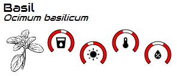
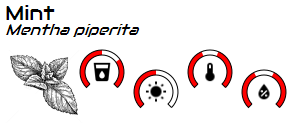

[![python][python-shield]][Python]
[![GitHub Release][releases-shield]][releases]
[![License][license-shield]](LICENSE)

[![Project Maintenance][maintenance-shield]][maintenance]
[![BuyMeCoffee][buymecoffee-shield]][buymecoffee]

# Label-maker
Python tool for generating informative labels (like labels for plant's pots or spices jars) out of JSON/YAML template files.

## Repository Contents
-------------------
* **/0_Resources**: Containing graphic material for the labels 
* **/1_Plants**: Contains the python scripts and some examples for generating:
    * Printable labels for your plants
    * E-paper labels to have as SmartPlant background templates 
    
     
     

* **/2_Spices**: Contains the python scripts and some examples of the generated printable labels for your favourite spices

    
    

[python-shield]: https://img.shields.io/badge/python-3670A0?style=for-the-badge&logo=python&logoColor=ffdd54
[python]: https://www.python.org/

[releases-shield]: https://img.shields.io/github/release/JGAguado/Label-maker.svg?style=for-the-badge
[releases]: https://github.com/JGAguado/Label-maker/releases

[license-shield]: https://img.shields.io/github/license/JGAguado/Label-maker.svg?style=for-the-badge

[maintenance-shield]: https://img.shields.io/badge/maintainer-J.%20G.%20Aguado-blue.svg?style=for-the-badge
[maintenance]: https://github.com/JGAguado

[buymecoffee-shield]: https://img.shields.io/badge/buy%20me%20a%20coffee-support-yellow.svg?style=for-the-badge
[buymecoffee]: https://www.buymeacoffee.com/J.G.Aguado
